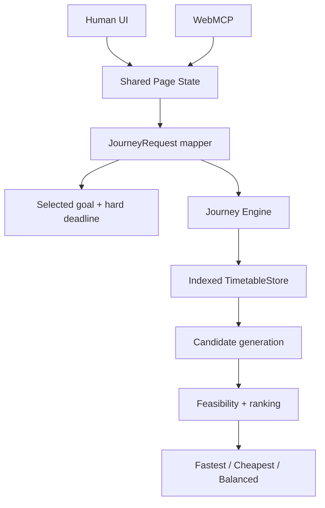

# Architecture



The Human UI and WebMCP tools read the same live page state. The mapper resolves the selected goal into the canonical `JourneyRequest`; the deterministic engine then queries node/time-indexed departures, generates executable candidates, evaluates goal feasibility, and ranks the results.

```text
Current node + current journey time
        → replanJourney()
        → new JourneyRequest
        → same planJourney()
```

Replanning recomputes the remaining trip rather than modifying a prior itinerary. The primary checked-in context is the frozen official 2026-08-31..2026-09-06 THSR scheduled-timetable export shared by the UI and WebMCP adapter. The import layer builds a dated SQLite validation database and exports the static browser runtime; the browser never depends on the private import database, provider credentials, or live TDX calls. Synthetic fixtures remain test-only.
