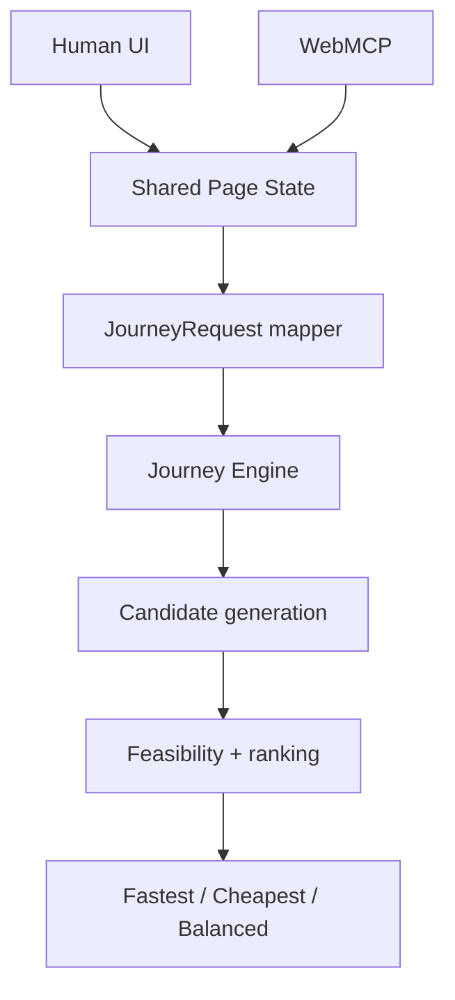

# Architecture



The Human UI and WebMCP tools read the same live page state. The mapper produces a canonical `JourneyRequest`; the deterministic engine then generates executable candidates, evaluates feasibility, and ranks the results.

```text
Current node + current journey time
        → replanJourney()
        → new JourneyRequest
        → same planJourney()
```

Replanning recomputes the remaining trip rather than modifying a prior itinerary. The current Challenge context is a synthetic fixed timetable shared by the UI and WebMCP adapter.
