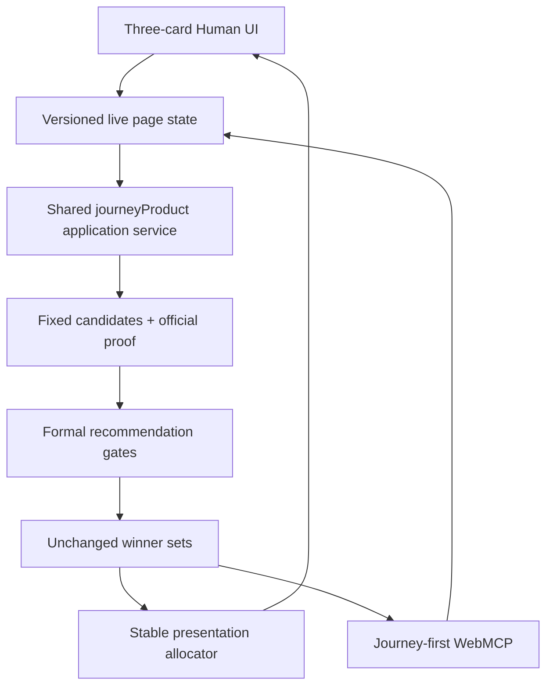

# Architecture



The Human UI and Journey-first WebMCP tool read the same versioned live page state and call the same application service. The request fingerprint binds origin, destination, goal, departure, allowed modes, preferences, current state, and progress. Unsupported or changed input returns an empty `UNAVAILABLE` plan instead of reusing a prior result. The formal gate computes winner sets; a separate stable allocator chooses three distinct presentation candidates only from those sets.

The additive corridor acquisition path reuses the same domain vocabulary:

```text
TDX MaaS gc=1 / 0.5 / 0
        → canonical WALK / WAIT / BOARD / RIDE / ALIGHT /
          TRANSFER_WALK / GOAL_ACCESS / GOAL_COMPLETION
        → connection validator
        → dedupe
        → normalized snapshot
```

The OAuth client and MaaS fetcher are server/import-only. Browser entry points never import credentials or call TDX. Mode-specific timetable/fare enrichers and GIS geometry remain explicit later seams; missing data is not inferred.

```text
Current node + current journey time
        → replanJourney()
        → new JourneyRequest
        → same planJourney()
```

The current fixed snapshot cannot prove an executable remainder for the demonstrated +8-minute progress state, so product replanning fails closed with `REPLAN_UNAVAILABLE_FOR_SNAPSHOT_STATE`. It preserves the selected plan, completed-step evidence, and downstream stale boundary; it never modifies the frozen evidence or invents a service. The browser never depends on the private import database, provider credentials, wall clock, or live TDX calls. The earlier indexed THSR engine remains available to the compatibility goal-feasibility tool and golden tests.
