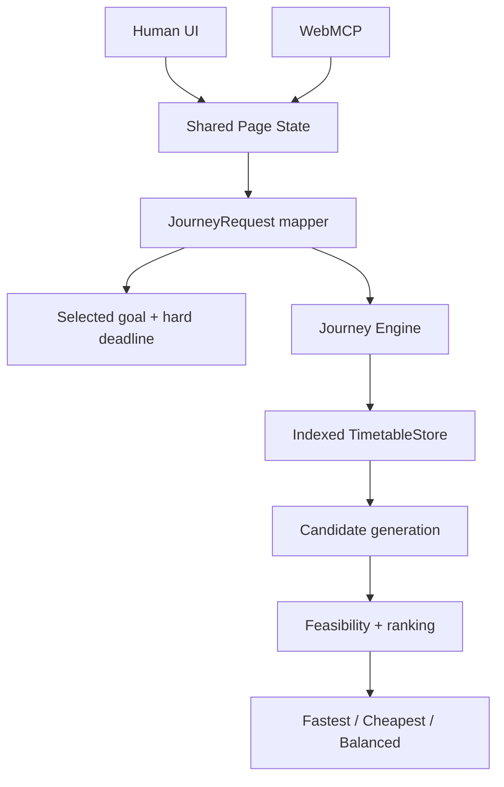

# Architecture



The Human UI and WebMCP tools read the same live page state. The mapper resolves the selected goal into the canonical `JourneyRequest`; the deterministic engine then queries node/time-indexed departures, generates executable candidates, evaluates goal feasibility, and ranks the results.

The additive corridor acquisition path reuses the same domain vocabulary:

```text
TDX MaaS gc=1 / 0.5 / 0
        → canonical WALK / WAIT / BOARD / RIDE / ALIGHT /
          TRANSFER_WALK / GOAL_ACCESS / GOAL_COMPLETION
        → connection validator
        → dedupe
        → normalized snapshot
```

The OAuth client and MaaS fetcher are server/import-only. Browser entry points never import credentials or call TDX. Mode-specific timetable/fare enrichers and GIS geometry remain explicit later seams; missing data is not inferred.

```text
Current node + current journey time
        → replanJourney()
        → new JourneyRequest
        → same planJourney()
```

Replanning recomputes the remaining trip rather than modifying a prior itinerary. The primary checked-in browser context remains the frozen official 2026-08-31..2026-09-06 THSR scheduled-timetable export shared by the UI and WebMCP adapter. The new MaaS corridor snapshot is checked in as a bounded normalized acquisition artifact but is not silently substituted into the primary browser runtime. The browser never depends on the private import database, provider credentials, or live TDX calls. Synthetic fixtures remain test-only.
