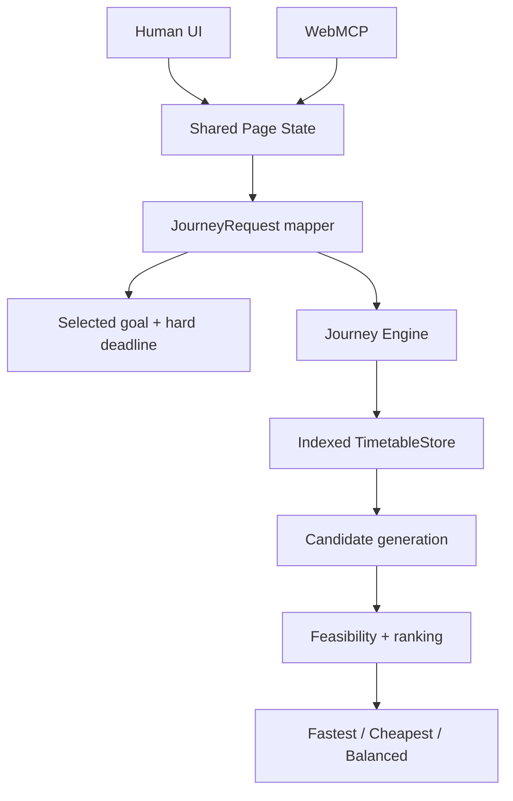

# Architecture



The Human UI and WebMCP tools read the same live page state. The mapper resolves the selected goal into the canonical `JourneyRequest`; the deterministic engine then queries node/time-indexed departures, generates executable candidates, evaluates goal feasibility, and ranks the results.

```text
Current node + current journey time
        → replanJourney()
        → new JourneyRequest
        → same planJourney()
```

Replanning recomputes the remaining trip rather than modifying a prior itinerary. The current checked-in context is a synthetic fixed timetable shared by the UI and WebMCP adapter. The import layer can build a dated SQLite validation database and export a static browser runtime; the browser never depends on the private import database or provider credentials.
